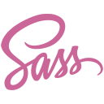

  
    
  <samp>
    Je suis Romain Herault 
      
    :rocket: Développeur Web Full Stack ! :rocket:
  </samp>

 

  
 <b>Chose à savoir sur moi !</b> <i>(cliquez pour voir plus)</i> 

  
   
  
---
> Retrouvez mon portfolio [ici](https://rherault.fr)

### - A propos...
- J'ai 21ans et je vis en France.
- J'adore apprendre de nouvelles choses.

---
### - Langages et outils...

  
  
  
  
  
  

---

### - Actuellement en train...

- D'améliorer mes compétences en Vuejs.
- D'apprendre Flutter.

---

 
  <i> Contactez-moi ! :incoming_envelope: </i>

   &nbsp; &nbsp;
   &nbsp; &nbsp;

